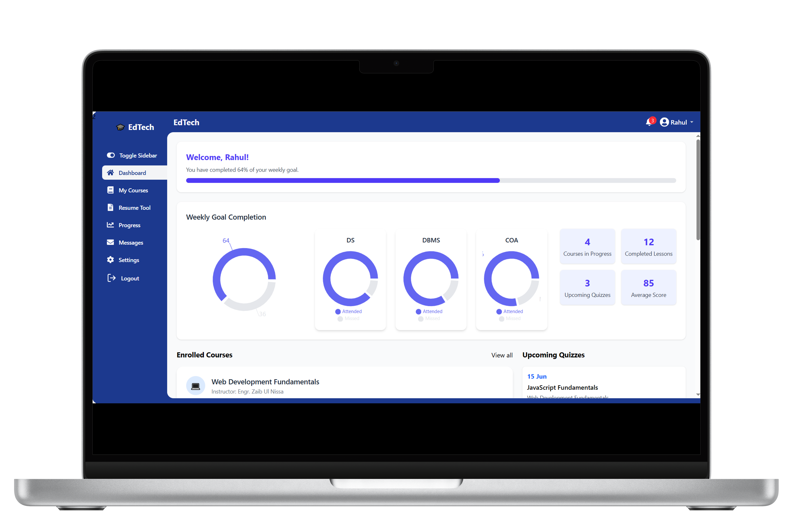
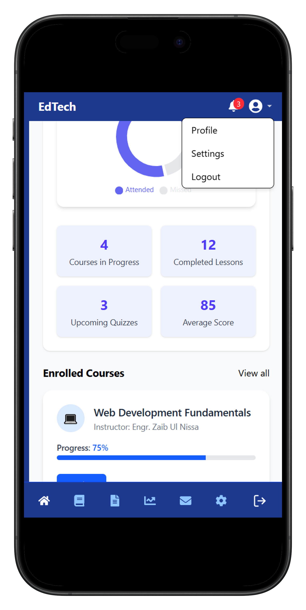
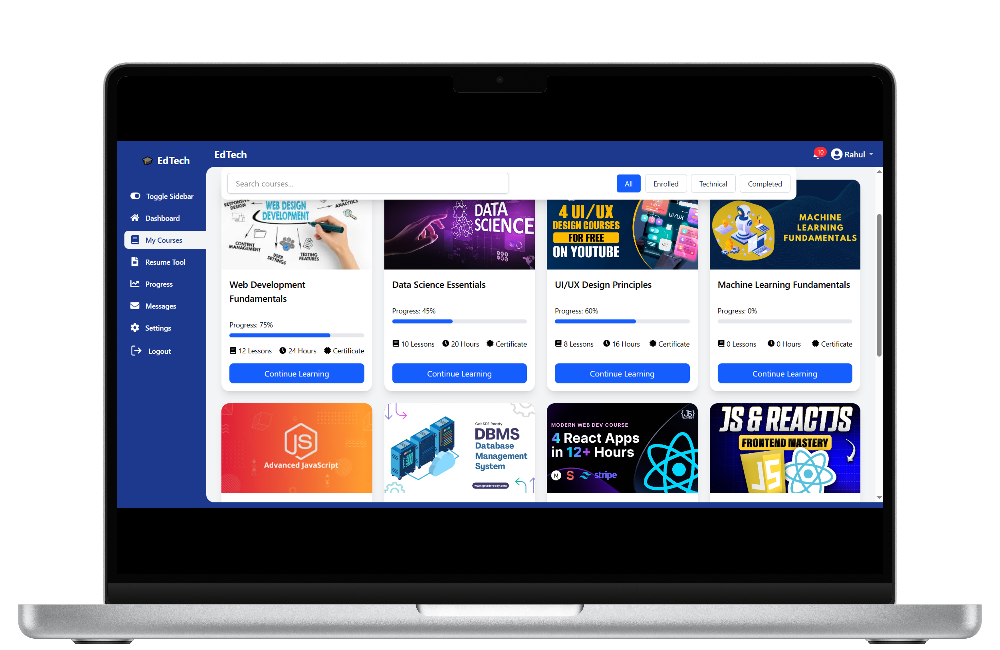
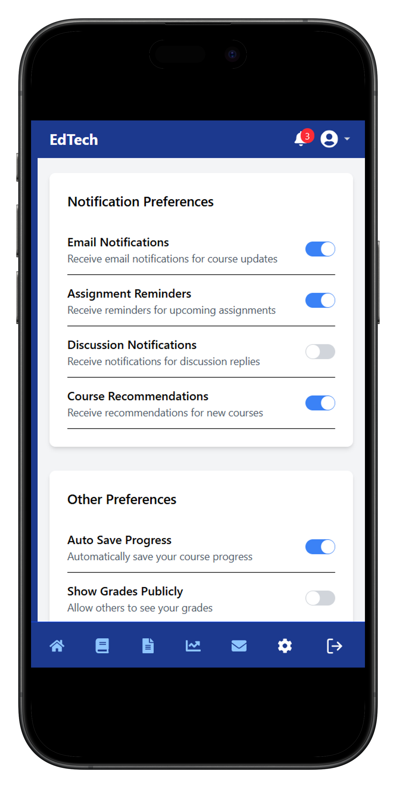
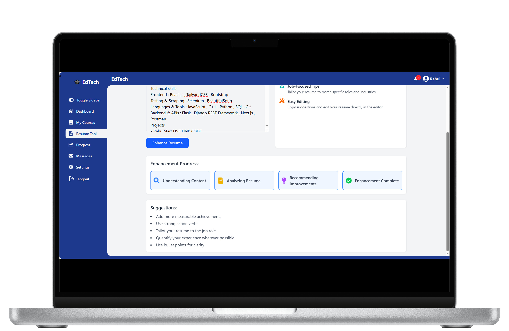
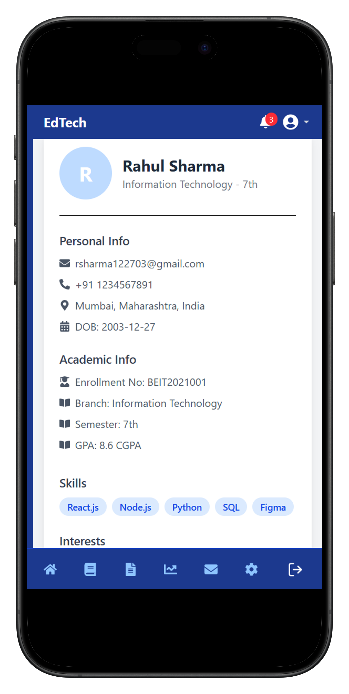

# Student Dashboard

## Live Demo

Try it out here: https://student-ed-tech-dashboard.vercel.app

## Steps to Install the Project

1. Clone the project
   ```bash
   git clone https://github.com/Rahul122703/StudentEdTechDashboard.git
   ```
2. Navigate into the project directory
   ```bash
   cd StudentEdTechDashboard
   ```
3. Install dependencies
   ```bash
   npm install
   ```
4. Run the development server
   ```bash
   npm run dev
   ```

## Tech Stack

- ReactVite
- Tailwind CSS
- Redux Toolkit
- Recharts
- Axios

## Screenshots

| Desktop Preview                  | Mobile Preview                  |
| -------------------------------- | ------------------------------- |
|  |  |
|  |  |
|  |  |

## Project Information

This is a **responsive student dashboard** built with React and Tailwind CSS, offering a professional and dynamic interface for learners. Below are the key modules and features:

---

### 1. **Home**

- Provides an **overall summary** of the student’s data such as:
  - Courses completed
  - Progress overview
  - Notifications (with real-time updates via bell icon)

---

### 2. **My Courses**

- View all enrolled courses in a centralized and connected layout
- **Dynamic category filters** – New categories added in the database will automatically render as buttons
- Search functionality to find courses by title
- Fully **responsive course cards** for desktop and mobile views

---

### 3. **Resume Tool**

- Upload resume as **PDF or paste as text**
- Click **“Enhance Resume”** to get sample suggestions
- Visual progress bar showing: `Understanding → Analyzing → Recommending → Complete`

---

### 4. **Progress**

- Displays course progress in card format
- **Consistency heatmap** similar to GitHub’s contribution graph

---

### 5. **Messages**

- Organized messaging from:
  - Admin
  - Instructors
  - Support
- Features:
  - **Mark as Read**
  - **Delete messages** (real-time reflection in the notification bell icon)
  - **Pagination**, **Expand/Collapse**, **Reply**

---

### 6. **Settings**

- Toggle switches to customize your dashboard preferences
- Example toggles include:
  - **Email Notifications**
  - **Assignment Reminders**
  - **Auto Save Progress**
  - **Show Grades Publicly**

---

### 7. **Profile**

- Displays student information including:
  - Name
  - Grade
  - Skills

---

### 🔗 Additional Highlights

- **Centralized data architecture** – All course-related data and UI are tightly coupled and synchronized
- Notification system triggered **automatically on first page load**
- Easily scalable and modular component structure
